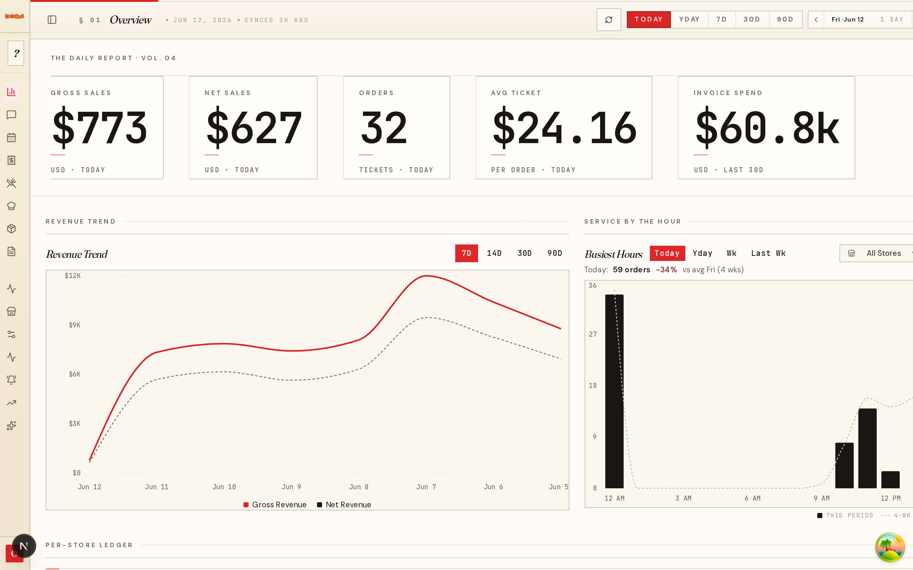
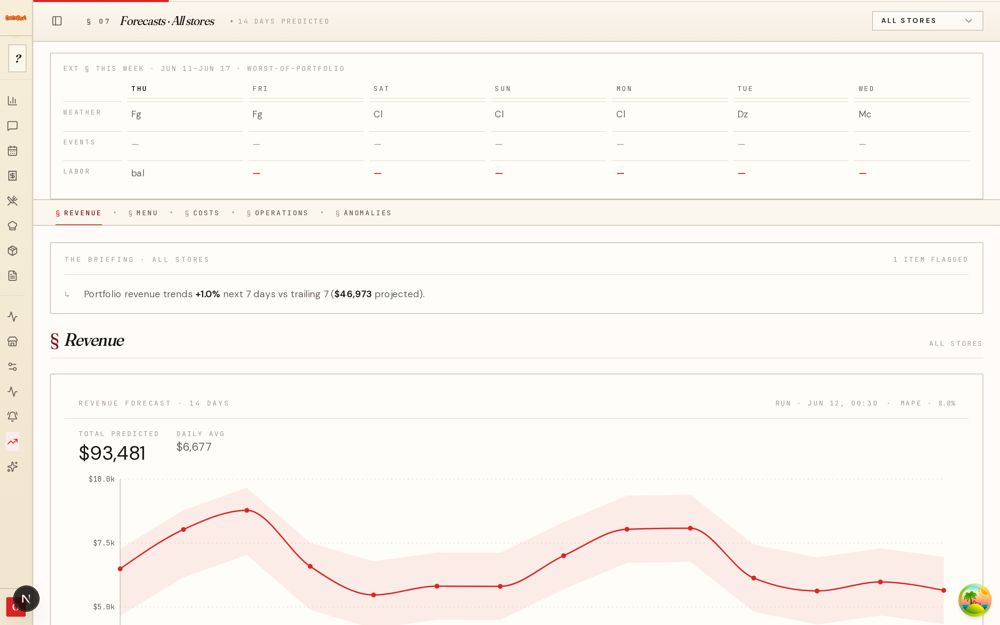
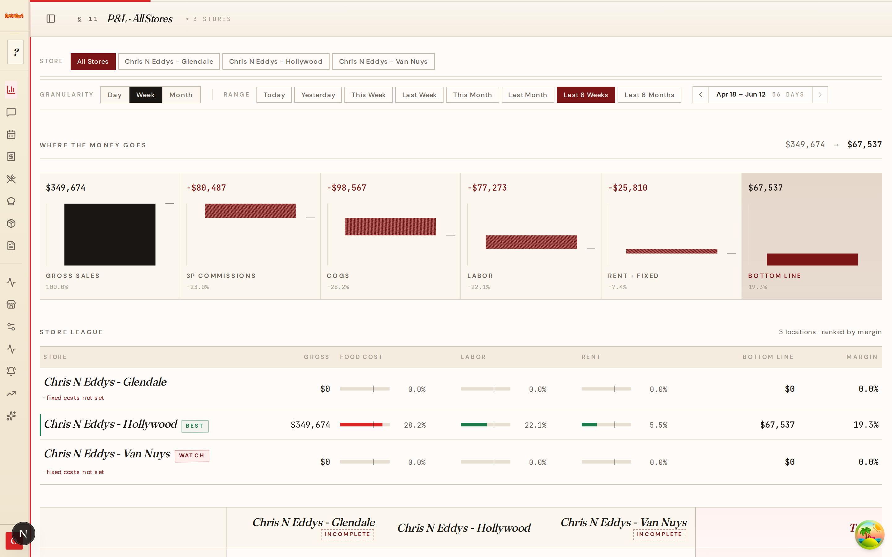
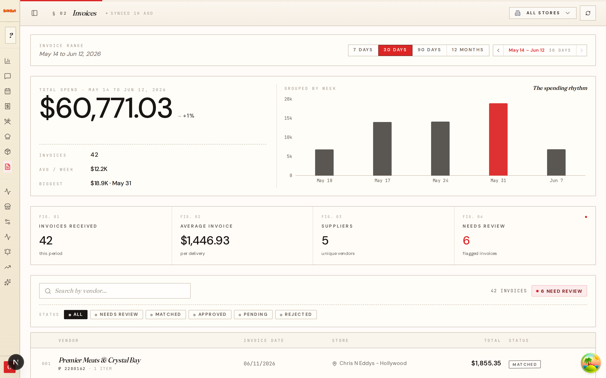
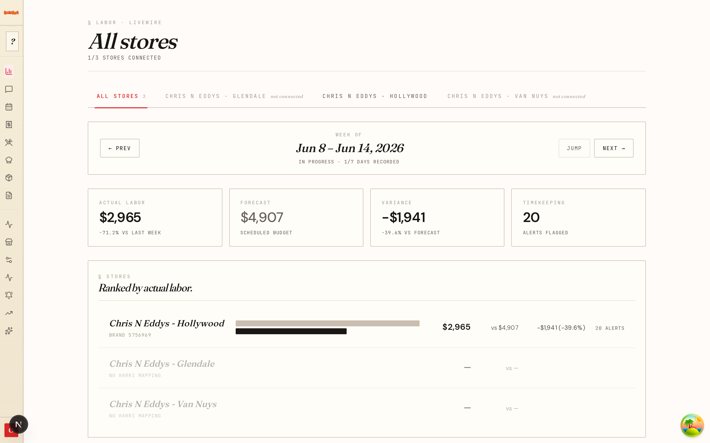
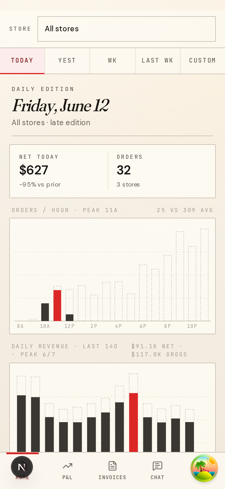
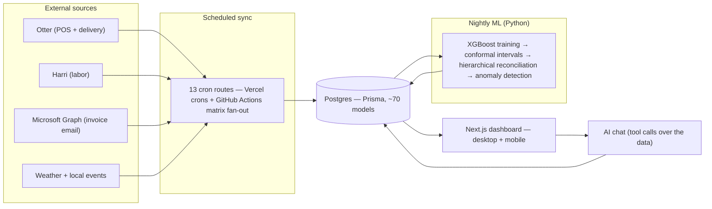

# Restaurant Dashboard

Multi-store restaurant analytics, in production at [Chris N Eddy's](https://www.chrisneddys.com) (Los Angeles). One reconciled view of sales, costs, labor, and forecasts — built to replace platform-hopping across Otter, Harri, POS exports, Yelp, and spreadsheets. The goal: a 30-second financial answer without opening five tabs, and books that tie at 11pm.

This is a real operating system for a real restaurant business, and the source is open under MIT. It is not a SaaS template; the roadmap is driven by what the operator needs next.



**Stack:** Next.js 16 (App Router) · React 19 · TypeScript · Prisma 7 / Postgres · TanStack Query · Tailwind v4 · Python ML (XGBoost) · Vercel + GitHub Actions

## What it does

- **Sales & orders** — hourly and daily revenue synced from Otter (first-party POS and DoorDash / UberEats / Grubhub), down to individual order rows.
- **P&L** — gross sales through bottom line per store: third-party commissions, COGS, labor, fixed costs, ranked store league.
- **Invoices & COGS** — vendor invoices ingested from email via Microsoft Graph, line items matched to canonical ingredients (embeddings + SKU matching), recipe costing, daily COGS recomputation.
- **Labor** — Harri integration: actual vs forecast labor, position-level daily breakdowns, timekeeping alerts.
- **Forecasts** — nightly ML revenue / hourly-order / menu-item forecasts with confidence bands (details below).
- **Alerts** — anomaly events from the nightly pipeline land in a contextual inbox.
- **AI chat** — tool-calling assistant over the business data (OpenAI), with evals (`npm run eval:chat`).
- **Mobile** — a parallel `(mobile)/m/**` route tree for managers checking prep status and numbers from a phone.

| Forecasts | P&L |
| --- | --- |
|  |  |

| Invoices | Labor |
| --- | --- |
|  |  |

<p align="center">
  
</p>

## Architecture



Key decisions:

- **Everything is precomputed.** Cron routes (secured by a shared `withCronAuth()` wrapper and `CRON_SECRET`) sync external sources into Postgres; the ML pipeline writes forecast rows back. Request-time work is reads and light aggregation — no third-party API calls or model inference on the hot path.
- **One tenant boundary.** Every query is scoped through the `Account` model; owner and manager roles get separate route trees (`/dashboard` vs `/manager`).
- **Per-store fan-out.** Heavy syncs (Otter, Harri, COGS) run as GitHub Actions matrix jobs — a `*/stores` cron route enumerates active stores, the matrix runs one job per store.
- **Operational self-monitoring.** The dashboard monitors itself: job runs, AI token spend, error events, cache hit rates, database and R2 storage snapshots all land in the same Postgres and surface on `/dashboard/monitoring`.

More depth: [`SECURITY.md`](SECURITY.md)

## The ML pipeline

A Python pipeline ([`ml/`](ml/)) trains per-store models nightly on GitHub Actions and writes predictions to Postgres; the dashboard only ever reads.

- **Models** — XGBoost for daily revenue, hourly orders, and menu-item demand, with engineered features from sales history, weather, and local event signals.
- **Uncertainty** — conformal prediction intervals (MAPIE), so forecast bands have coverage guarantees rather than vibes.
- **Coherence** — hierarchical reconciliation (MinTrace) so menu-item, category, and store-level forecasts sum consistently.
- **Anomalies** — z-score detection on actuals vs forecast feeds the alerts inbox.
- **Trust gates** — WAPE-based operator gates decide per store, per day, whether forecasts are good enough to show an operator; verdicts are recorded, not assumed.
- **Store lifecycle** — a state machine (`pre_open → warming_up → ready`) handles new locations, with transfer learning from the established store's prior until a new store has its own history.

Entry point is `python -m ml.run_nightly`; see [`ml/README.md`](ml/README.md).

## Design system

The UI deliberately avoids stock dashboard chrome. It is an "editorial docket": cream paper, hairline frames instead of card shadows, Fraunces serif for prose, DM Sans tabular figures for every number, JetBrains Mono for captions and SKUs, and a single red reserved for emphasis. The rules live in [`DESIGN.md`](DESIGN.md), and they are enforced in review — generic Tailwind palettes and shadcn `<Card>` composition are rejected on dashboard routes.

## Getting started

Prerequisites: Node 20+, a Postgres database ([Neon](https://neon.tech) works well), and optionally Python 3.12 for the ML pipeline.

```bash
git clone https://github.com/vanyanv/restaurant-dashboard.git
cd restaurant-dashboard
npm install

cp .env.example .env.local   # fill in DATABASE_URL and NEXTAUTH_SECRET
npm run db:reset             # pushes the schema and seeds demo data (destructive — fresh databases only)
npm run dev
```

Seeding creates a local demo owner account with sample stores (the seed script prints the credentials), so the dashboard renders without any integration keys. The production deployment is private and is not linked here.

### Environment variables

| Variable | Purpose |
| --- | --- |
| `DATABASE_URL` | Postgres connection (required) |
| `NEXTAUTH_SECRET` | JWT session signing (required; `openssl rand -base64 32`) |
| `CRON_SECRET` | Bearer auth for all cron routes (required in production) |
| `UPSTASH_REDIS_REST_URL` / `_TOKEN` | Cache and rate limiting (required in production) |
| `OTTER_*`, `HARRI_*`, `MICROSOFT_*`, `YELP_API_KEY` | Per-integration sync credentials (optional — the matching sync simply doesn't run) |
| `OPENAI_API_KEY` | AI chat and embeddings (optional) |
| `R2_*` | Cloudflare R2 for invoice PDFs (optional) |

See [`VERCEL_DEPLOYMENT.md`](VERCEL_DEPLOYMENT.md) for the production checklist.

## Testing

| Suite | Command | Scope |
| --- | --- | --- |
| Vitest | `npm test` | Unit and contract tests for server actions, aggregation math, cron auth |
| Playwright | `npm run e2e` (`e2e:smoke` runs on pre-push) | Desktop (1440×900) and mobile (Pixel 7) flows against a real login |
| pytest | `python -m pytest` | ML pipeline: training, conformal coverage, reconciliation, gates |

## Project structure

```
src/
  app/
    dashboard/        # Owner dashboard (~20 sections: pnl, forecasts, cogs, labor, ...)
    (mobile)/m/       # Mobile-first route tree for the same domains
    manager/          # Manager-scoped pages
    api/cron/         # 13 authenticated sync/maintenance jobs
    actions/          # Server actions
  lib/                # Domain logic (otter, harri, chat tools, labor math, formatters)
  components/         # UI components (editorial design system)
ml/                   # Python: nightly training, reconciliation, anomalies, gates
prisma/               # Schema (~70 models) + seed
e2e/                  # Playwright suites
.github/workflows/    # 19 workflows: scheduled syncs, nightly ML, audits
```

Files over 400 lines get split using a documented method ([`docs/refactor-playbook.md`](docs/refactor-playbook.md)): contract tests first, then extraction behind a re-export shim.

## Contributing

Issues and PRs are welcome. Keep in mind this codebase runs a live business — changes to money math need contract tests, and dashboard UI must follow the design system. `npm test` and `npm run e2e:smoke` must pass (the pre-push hook runs the smoke suite).

## License

[MIT](LICENSE)
